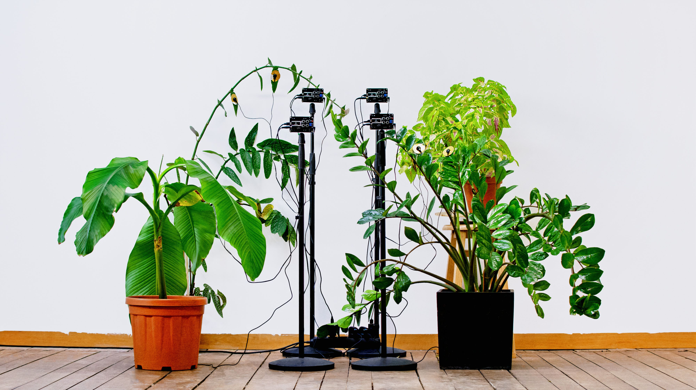

## The Plant Quartett

The Plant Quartet is a sound installation that provides an ambient listening experience of plants by using multiple Soniplasts, a custom-designed instrument that translates biodata from plants into sound. Similar as Chloroplasts, which are organelles that conduct photosynthesis in plants, a Soniplast takes bioelectric potential data from a plant and use it to modulate a simple sine wave.

The Plant Quartet pays attention to the relative differences in rhythmic cycles among plants and how they contribute together to a musical composition. By amplifying the ubiquitous existence of plants through sound, the objective of the project is to encourage an intimate relationship with plants in a slow, subtle and collective manner.

### Artist Bio
Qianxun Chen is a media artist, programmer and researcher. She works at the intersection of art, technology and language, with a focus on generative poetics, the aesthetics of algorithm and digital textuality. Her works tend to bring up artistic and non-human perspectives of the world through alternative usage of technology.

### Sound Samples
[Sound Cloud](https://soundcloud.com/user-523089589/the-plant-quatett)

### Links
[PCB Design](https://github.com/digitalmediabremen/plantSonification/blob/main/pcb/pcbDesign.md) |
[Concept](https://github.com/digitalmediabremen/plantSonification/blob/main/concept.md) | [Notes](https://github.com/digitalmediabremen/plantSonification/blob/main/notes.md)
