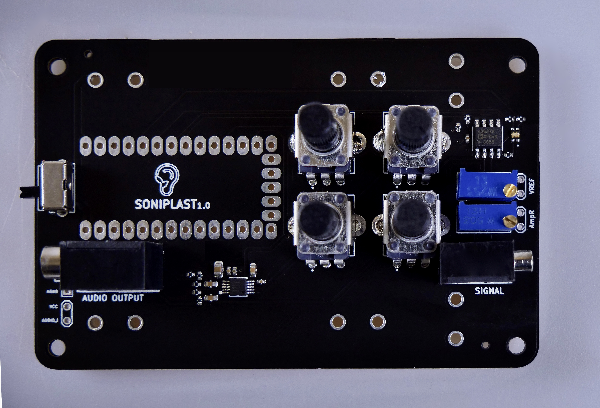

#### Schematics

#### 3D Preview(Front)

#### 3D Preview(Back)

#### BOM
|Comment                                                                                        |Designator     |Footprint          |JLCPCB Part #|
|-----------------------------------------------------------------------------------------------|---------------|-------------------|-------------|
|1uF Polarized capacitor                                                                        |C1             |C_0402_1005Metric  | [C52923](https://jlcpcb.com/parts/componentSearch?isSearch=true&searchTxt=C52923)      |
|3,3uF Polarized capacitor                                                                      |C6,C3,C4       |C_0603_1608Metric  |[C51412](https://jlcpcb.com/parts/componentSearch?isSearch=true&searchTxt=C51412)       |
|0.1uF Unpolarized capacitor, small symbol                                                      |C7,C5,C2       |C_0402_1005Metric  | [C1525](https://jlcpcb.com/parts/componentSearch?isSearch=true&searchTxt=C1525)       |
|10uF Polarized capacitor                                                                       |C8             |C_0805_2012Metric  | [C15850](https://jlcpcb.com/parts/componentSearch?isSearch=true&searchTxt=C15850)       |
|CLV1L-FKB Cree PLCC4 3 in 1 SMD LED                                                            |D1             |19037ARSGHBHW1S032T| [C282128](https://jlcpcb.com/parts/componentSearch?isSearch=true&searchTxt=C282128)     |
|SIGNAL                                                                                         |J1             |PJ-2105-3A         | [C145821](https://jlcpcb.com/parts/componentSearch?isSearch=true&searchTxt=C145821)     |
|AUDIO OUTPUT Audio Jack, Dual, 2 Poles (Mono / TS), Grounded Sleeve, Switched Pole (Normalling)|J2             |PJ325M             | [C26230](https://jlcpcb.com/parts/componentSearch?isSearch=true&searchTxt=C26230)       |
|10k Resistor                                                                                   |R2,R1          |R_0402_1005Metric  | [C144807](https://jlcpcb.com/parts/componentSearch?isSearch=true&searchTxt=C144807)     |
|2K Resistor                                                                                    |R3             |R_0402_1005Metric  |  [C163822](https://jlcpcb.com/parts/componentSearch?isSearch=true&searchTxt=C163822)      |
|470R Resistor                                                                                  |R4,R5          |R_0402_1005Metric  |  [C163829](https://jlcpcb.com/parts/componentSearch?isSearch=true&searchTxt=C163829)     |
|220R Resistor                                                                                  |R6,R7,R8       |R_0402_1005Metric  |  [C25091](https://jlcpcb.com/parts/componentSearch?isSearch=true&searchTxt=C25091)     |
|10k Potentiometer, US symbol                                                                   |RV1,RV2,RV3,RV4|RK09K1130A5R       |  [C209779](https://jlcpcb.com/parts/componentSearch?isSearch=true&searchTxt=C209779)     |
|50k Potentiometer                                                                              |RV5            |TRIM_3296W-1-503   | [C118911](https://jlcpcb.com/parts/componentSearch?isSearch=true&searchTxt=C118911)      |
|25k Potentiometer                                                                              |RV6            |TRIM_3296W-1-253   | [C118932](https://jlcpcb.com/parts/componentSearch?isSearch=true&searchTxt=C118932)      |
|SW_SPDT Switch, single pole double throw                                                       |SW1            |SK12D07VG4         | [C393937](https://jlcpcb.com/parts/componentSearch?isSearch=true&searchTxt=C393937)      |
|AD627ARZ-R7                                                                                    |U1             |AD627ARZ-R7        | [C9674](https://jlcpcb.com/parts/componentSearch?isSearch=true&searchTxt=C9674)        |
|CS4344-CZZR                                                                                    |U2             |CS4344:CS4344-CZZR | [C8952](https://jlcpcb.com/parts/componentSearch?isSearch=true&searchTxt=C8952)        |
